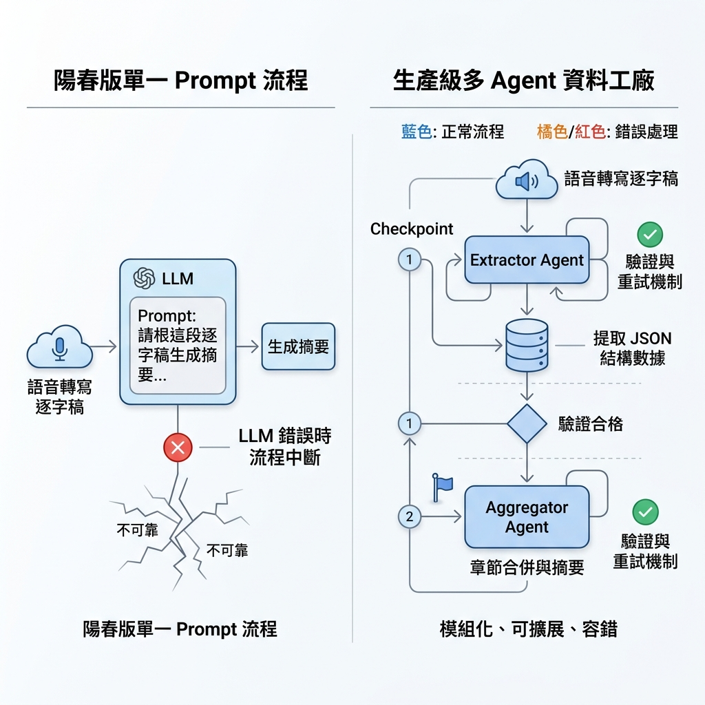
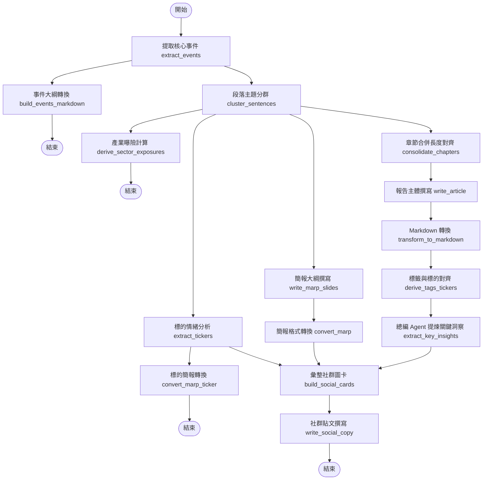
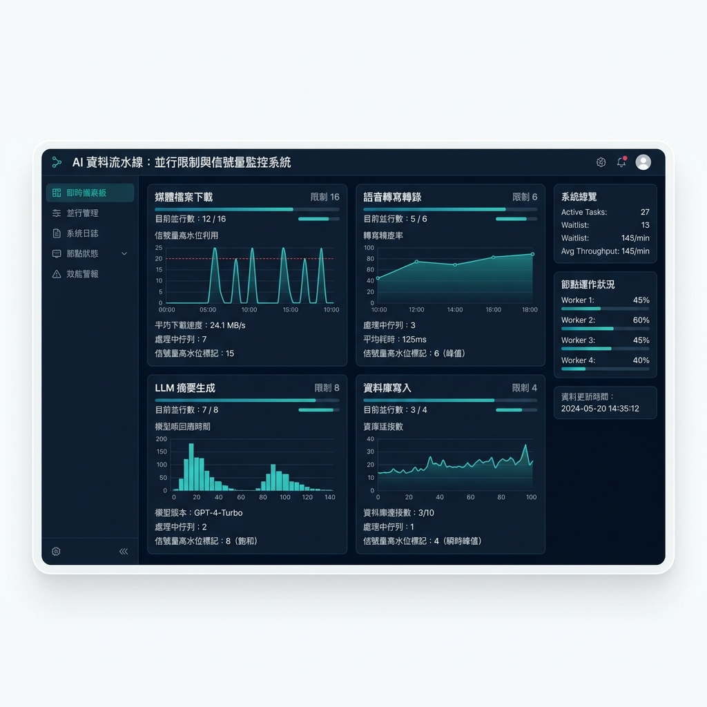

# 如何設計一條可靠的 Agentic Ingestion Pipeline：從單一 Prompt 到 LangGraph 多 Agent 協作的財經 Podcast 摘要系統實踐

最近我花了一段時間，將專案中負責處理**財經 Podcast** 語音與逐字稿的 AI 數據 Pipeline，從最初的單一 Ingestion 腳本逐步演進為基於多 Agent 協作的生產級版本。

在我的實踐中，我發現最大的挑戰並非語音轉文字本身（透過呼叫 Groq API 等語音轉寫服務，將音訊轉為原始逐字稿已經非常便宜且容易解決），而是**如何從極度冗餘、充滿雜訊的逐字稿中，產出穩定、高品質且符合結構化 Schema 的財經摘要與標的分析**。

這篇文章我想分享自己在這段演進過程中的實踐心得，記錄我是如何一步步克服「請 LLM 幫我摘要」的瓶頸，並設計出一個由多個 Agent 協同作戰、具備容錯快照的摘要系統。

---

## 陽春版的瓶頸：為什麼「請幫我摘要這段逐字稿」注定失敗？

在剛開發第一代 Ingestion 腳本時，我的作法非常直覺：取得原始逐字稿後，直接包進一個簡單的 Prompt 中送給大語言模型，指令大概就是「請幫我整理這段逐字稿的摘要、重點與提及的市場標的數據（Market Ticker Data）」。

然而，實際面對真實的財經 Podcast 節目時，這種做法產出的摘要簡直不堪入目，原因在於真實的對談音訊中充斥著以下雜訊：

- **廣告與贊助商訊息**：播客們常常在開頭或中間穿插 VPN、床墊、線上課程或券商的廣告。大模型在處理時，很容易將這些廣告內容誤認為本集討論的「財務洞察」，甚至直接寫進摘要重點。
- **生活雜談與幽默笑話**：主持人之間在切入正題前，通常會有數分鐘至十幾分鐘的暖場聊天、近況分享。這些內容雖然能增加節目娛樂性，但對尋求財務洞察的讀者而言完全是多餘的。
- **訪談的口語冗餘與跳躍思考**：尤其是雙人主持或專訪節目，充滿了口語贅字與跳躍性對談。整篇逐字稿往往長達兩三萬字，但真正有價值的核心觀點可能只佔 10%。
- **多人對話交錯**：在專訪或多主持人節目中，談話內容常在多個標的之間快速切換，甚至夾雜主持人的隨口插話。如果直接硬吞，模型很容易在長文本中注意力渙散（Lost in the Middle），導致摘要內容時而詳細、時而漏掉關鍵個股。

如果只用一個 Prompt 硬吞整篇逐字稿，大模型不是因為 Context 過長而偏離主題，就是因為格式錯亂而崩潰。為了產出真正具有專業水準、只保留財經核心洞察的精簡資料，我意識到必須將任務解耦，改由多個專門的 Agent 來分工協作。

---

## 基於 LangGraph 的多 Agent 協作設計

為了解決單一模型調用的局限性，我選擇使用 LangChain 與 **LangGraph** 來重新建構整個工作流。

LangGraph 的「狀態圖（StateGraph）」概念非常適合這種複雜的 DAG（有向無環圖）流程。我們能定義一個共享的狀態對象（State），讓每個節點（Node）只負責處理狀態中的一部分資料，並在完成後更新狀態，最後傳遞給下一個節點。這樣做的好處是，我們能將「閱讀、過濾、章節合併、報告撰寫、個股分析、品質校驗」等工作完全解耦。

### 系統拓撲設計

這是我在專案中實際編排的 StateGraph 拓撲流程。整個 Pipeline 在執行時，會從入口節點進入，進行平行分流與最終的匯合（Fan-out / Fan-in）：

---

## 核心 Agent 與節點的分工

在這套 LangGraph 工作流中，每個節點都有其明確的輸入、輸出與限制：

### 1. 提取 Agent (`extract_events`)
*   **職責**：雜訊清理與核心事件提取。
*   **工作邏輯**：它是整條 Pipeline 的第一線。它會通讀原始逐字稿，其目標不是寫摘要，而是進行「掃描與標記」。它會將逐字稿中的段落歸類為特定的封閉詞彙標籤（包括 sponsor, intro, outro, chitchat, analysis, guest, qa, unknown），並標記該段落是否具備「市場實質內容（is_substantive）」。
*   **分片設計 (Sentence-Position Chunking)**：超長的 Podcast 逐字稿如果一次全部送給 LLM 進行提取，模型回傳的 JSON 很容易因為長度限制而被截斷。我設計了「句子位置分片」機制：當句子數超過臨界值（1200 句）時，系統會自動將逐字稿切成每 800 句一組的分片分別進行呼叫，並將模型回傳的局部索引偏移還原回全域位置，最後再合併輸出。這徹底解決了長文本導致 LLM 輸出中斷的問題。

### 2. 政策路由器與章節合併器 (`cluster_sentences` & `consolidate_chapters`)
*   **職責**：結構化時間線與章節對齊。
*   **工作邏輯**：這是結合了確定性程式邏輯的節點。
    - **政策路由器**：根據節目的設定檔政策，直接丟棄非實質內容的段落（例如直接過濾 sponsor, intro, outro, chitchat 等廣告與閒聊），只保留具備市場分析價值的片段。這解決了以往使用關鍵字比對容易讓廣告漏網的問題。
    - **章節合併器**：由於提取 Agent 為了精準過濾廣告，會把事件切得非常細碎（例如一問一答就切出一個事件）。如果直接根據這些細碎事件寫摘要，報告會變得支離破碎。章節合併器會根據音訊時長動態計算目標章節數量（每 5 分鐘一個章節，最少 4 個，最多 12 個），把相鄰的細碎事件合併為適當長度的大章節，供後續撰寫使用。

### 3. 撰寫 Agent (`write_article`)
*   **職責**：內容組織與文案撰寫。
*   **工作邏輯**：它不閱讀冗長且多雜訊的原始逐字稿，而是拿著合併後的乾淨章節資訊進行擴寫。它負責將這些觀點整理成邏輯通順、專業嚴謹的財經報告初稿。
*   **分片撰寫與合併**：與提取階段類似，若輸入章節數過多，寫作節點也會進行分片（每 12 個章節一組）分別調用，最後再合併各段落的標題、前言、正文與結論，避免單次輸出 token 溢出。

### 4. 總編 Agent (`extract_key_insights`)
*   **職責**：事實核對與品質提煉。
*   **工作邏輯**：它是這條流水線的品質防線。它讀取撰寫 Agent 產出的 Markdown 報告，提煉出 3~8 條精簡的關鍵洞察（Takeaways），並進行嚴格的格式清洗（去除 markdown 符號、清單標記、時間戳記等），確保每條洞察字數在 80 字以內，符合前端卡片版面的要求。
*   **備用機制 (Fallback)**：當 LLM 因為生成異常而回傳少於 3 條洞察時，系統會啟動確定性備用機制，自動從 Markdown 摘要中依據句號切分，篩選出符合長度限制的句子進行遞補，確保資料庫欄位永遠對齊 3~8 條洞察的資料契約。

### 5. 標的分析 Agent (`extract_tickers`)
*   **職責**：個股標的情緒與風險深度剖析。
*   **工作邏輯**：專注於提取節目中提及的個股標的情緒（看多/看空/中立）、目標價與潛在風險，產出結構化的評級分析。

---

## 生產環境優化與踩坑經驗

在演進這套多 Agent 系統時，我積累了幾點關鍵的生產環境經驗：

### 1. 步驟化 Pipeline 狀態保存與恢復 (Step-by-step Checkpoints)
整個 Ingestion Pipeline 包含語音下載、STT 轉寫、LangGraph 摘要、GCS/Firestore 上傳等步驟。由於多 Agent 流水線包含多次 LLM 調用，整體執行時間可能長達數分鐘。如果每次後續節點（例如簡報轉換或社群圖卡渲染）出錯都得從頭來過，API 調用成本與等待時間會非常高昂。

為此，我實作了 **Checkpoint 狀態快照保存機制**。在每一個重大步驟完成後，中間狀態（如下載的音檔、轉寫好的逐字稿 text 與 sentences 結構、上傳 GCS 後的 URL 等）都會被持久化保存於資料庫中。

我引入了 `rerun_from` 的重試設計。如果後續的 Markdown 轉換、個股分析或社群圖卡渲染出錯，系統重新執行時會先載入已存檔的中間資料。例如，設定 `rerun_from` 為摘要階段（`summarize`），系統會直接從 GCS 下載已有的逐字稿，跳過下載 MP3 與 Groq 語音轉寫步驟，直接將狀態餵給 LangGraph。這大幅降低了重複調用 API 的開銷與時間延遲，也避免了重複的 STT 費用。

### 2. 模型選型與 OpenRouter 實驗結論

在開發過程中，我利用 **OpenRouter** 進行了深入的模型評估與對比（以主力推理模型與對照組模型如 Gemini 2.5 Flash 作為對照組），針對資訊提煉能力、標籤與個股標的提取精度，以及繁體中文的忠實度進行了全面測試。

#### 核心模型實驗對比

我選擇了兩個最具代表性的模型進行多輪測試，結果呈現出顯著的特徵差異：

| 評估維度 | 主力推理模型 (以 DeepSeek 為代表) | 對照組模型 (以 Gemini 2.5 Flash 為代表) |
| :--- | :--- | :--- |
| **摘要篇幅與結構** | 緊湊且具備社群編輯感（5 個章節）。能自動過濾非財經相關的職涯、生活成本閒聊。 | 較為冗長與直白（9 個章節）。傾向完整保留所有 Q&A 對答與雜談尾巴。 |
| **標籤與標的品質** | 標籤數量適中，高度符合專案中「封閉標籤詞彙表」的約束，防範分類碎片化。個股代號提取精準。 | 標籤嚴重通膨（高達百餘個），且會自我發明無效標籤（如隨機產生的英文詞彙），導致後續校驗被剔除。 |
| **個股情緒提取** | 能精確對齊段落，產出結構完整的多空論點與風險分析。 | 覆蓋面廣但資訊密度較低。 |

#### 推理模型的截斷踩坑與解決方案

雖然推理模型在摘要緊湊度與標的精準度上明顯勝出，但在實踐中，我踩到了一個嚴重的坑：長節目在提取核心事件或個股分析時，模型輸出的 JSON 常常在後半段被莫名截斷（出現 `Unterminated string` 等 JSON 解析錯誤），導致整個任務直接失敗，回退至預留的 placeholder 狀態。

經過深入排查，我發現推理模型（Reasoning Models）會將大量的 token 用於「隱藏思考過程（Reasoning tokens）」，這嚴重擠壓了真正輸出的 `max_tokens` 預算（如 4096 tokens）。

為了解決這個問題，我在呼叫 API 時**顯式關閉了推理思考過程**（透過傳入 `extra_body={"reasoning": {"enabled": False}}`）。這樣一來，模型就不會消耗預算在思考過程上，而是將完整的 token 預算留給結構化的 JSON 輸出，順利解決了超長 Podcast 導致輸出截斷的痛點。

最終，我將推理模型設定為全角色（提取、撰寫、總編、個股分析等）的預設模型，並同步標準化了背景守護程序與手動除錯腳本的模型配置，避免了因環境配置不一致而產生的 placeholder 降級。

### 3. 寫入前校驗防寫閘 (Pre-Persistence Gate)
在早期的版本中，如果外部摘要服務失敗，系統會回傳預留字元（placeholder）內容；或者當 LLM 產生幻覺時，提取出的個股清單（Related Tickers）與摘要 Markdown 的正文內容不一致（例如個股清單有 AAPL，但摘要內文中根本沒有提及蘋果公司）。如果直接將這些壞資料寫入 GCS 或 Firestore，就會覆蓋掉之前原本正確的歷史資料。

為此，我在寫入前增加了一個強校驗閘（`assert_summary_persistable`），在內存中直接驗證：
- **拒絕預留字元**：檢查 summary 是否包含預留字元標記（`is_placeholder`），若有則直接阻斷。
- **個股一致性校驗**：驗證 `related_tickers` 中的所有個股，是否都以特定格式（如 `#ticker:SYMBOL`）出現在 Markdown 摘要主體中。如果發現有任何個股漏掉，則判定為個股不匹配（Ticker Mismatch），直接拋出異常並拒絕寫入 GCS 與 Firestore，保護生產環境的資料完整性。

### 4. 併發預算與 Rate Limit 控制
多 Agent 協作意味著處理一個任務會瞬間產生多次模型呼叫。如果批次處理多個節目的話，很容易在 OpenRouter 端觸發 429 速率限制（Rate Limit）。

我利用 Python asyncio 的信號標（Semaphore）機制，為這三個 Agent 階段設定了獨立的併發信號標。這是我在監控後台對各個 Agent 階段併發限制進行觀測的視覺化面板示意圖：

---

## 圖表與配圖建議 (Visual Plan)

### 1. 線性 Pipeline 與可恢復資料工廠對比圖
- **用途**：展示單線 LLM 流程（容易出錯、無法部分恢復）與帶有 Checkpoint 的多 Agent 流程之健壯性對比。
- **位置**：置於架構設計與演進段落之首。
- **已嵌入圖片**：[images/linear-vs-recoverable-pipeline-zh.png](images/linear-vs-recoverable-pipeline-zh.png)
- **參考與啟發**：可參考 **Netflix Tech Blog** 介紹媒體處理管道的架構圖風格，以帶有快照與儲存的方塊圖呈現，使用乾淨的雙色調設計。

### 2. 多階段併發預算控制面板
- **用途**：將不同 Stage 依據頻寬、API 額度與資料庫寫入效能進行併發節流的抽象概念具體化。
- **位置**：置於異步任務編排段落。
- **已嵌入圖片**：[images/concurrency-budget-dashboard-zh.png](images/concurrency-budget-dashboard-zh.png)
- **參考與啟發**：參考 **Stripe Technical Blog** 在介紹 Rate Limiter 與併發防禦機制時使用的橫向儀表板圖表，展示不同階段的併發水位線與其對應的系統瓶頸。

---

## 總結

建構一個生產級的財經 Podcast Ingestion 管道，核心不在於單一 LLM 模型有多強，而是在於**如何通過工程化的設計，將不可預測的大模型調用包裝在一個可預測、可控制、具備容錯快照的軟體系統中**。

透過 LangGraph 進行多 Agent 節點分工（過濾、分群、章節合併、初稿、校驗與提煉），配合 Step-by-step Checkpoints 節省重複轉錄與 LLM 重載成本，並針對推理模型特性關閉 Reasoning tokens，這套系統得以在面臨各種口語雜訊與廣告干擾時，依然能穩定地建構出高品質的財經知識圖譜。

---

## Reference

- **[LangGraph Documentation](https://langchain-ai.github.io/langgraph/)**：深入理解如何使用 StateGraph、Nodes 和 Edges 建構具備循環與條件分支的多 Agent 系統。
- **[LangChain OpenAI Integration Guide](https://python.langchain.com/docs/integrations/chat/openai/)**：了解如何配置 ChatOpenAI 以及自訂 API 請求參數（如關閉 reasoning 或啟用 json_mode）。
- **[OpenRouter API Documentation](https://openrouter.ai/docs)**：理解 OpenRouter 提供的模型路由、429 Rate Limits 處理，以及如何透過 headers 自訂 App metadata。
- **[Python asyncio Documentation](https://docs.python.org/3/library/asyncio.html)**：深入學習 asyncio.Semaphore 與 Event Loop，以實現高效的異步任務編排。
