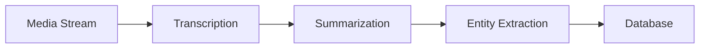
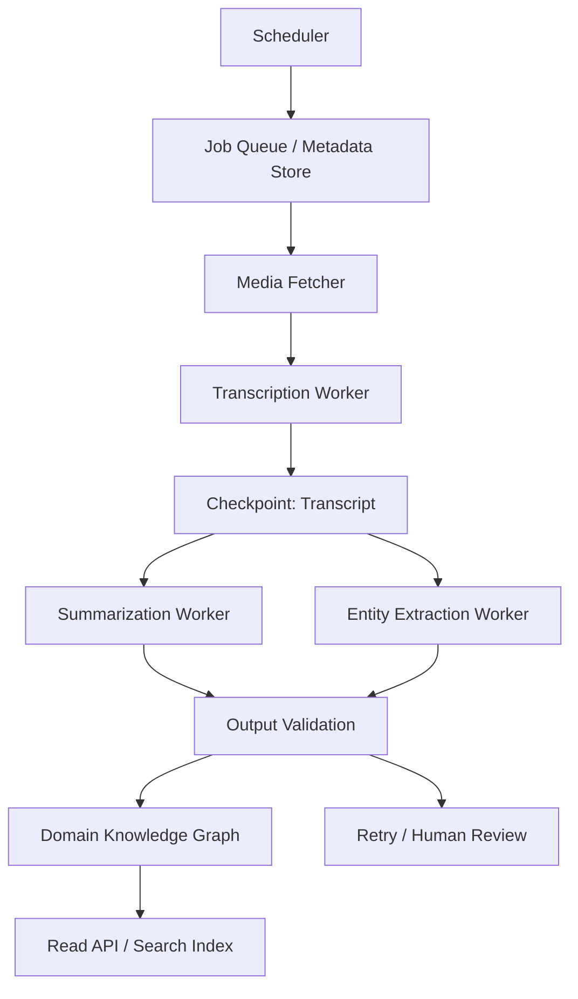
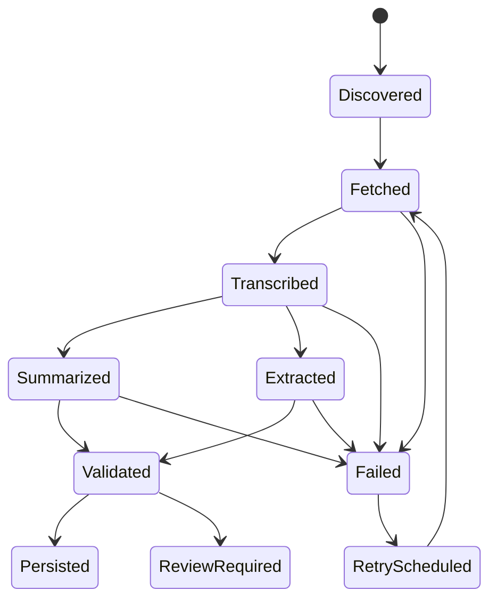

# 如何設計一條可靠的 Agentic Ingestion Pipeline：從「呼叫模型」到「可恢復的資料工廠」

## 前言 (Introduction)

很多團隊第一次把大模型接進產品時，會把 ingestion pipeline 想得太簡單：拿到一段非結構化多媒體語音串流，丟給轉錄模型，再丟給摘要模型，最後把結果存進資料庫。這條路在 demo 裡通常很順，但一進生產環境，就會開始遇到幾個典型問題：

1. 單一外部模型延遲不穩，p95 可能是 p50 的 3-5 倍。
2. 轉錄成功、摘要失敗、實體抽取成功一半，導致資料狀態不一致。
3. 重試沒有邊界，排程器一重跑就產生重複資料。
4. 批次任務太大，記憶體壓力上升；批次太小，外部 API 成本與排程 overhead 又太高。

所以，一條成熟的 Agentic Ingestion Pipeline 不是「把 LLM API 串在一起」，而是一座資料工廠。它需要狀態機、併發預算、可恢復的中間結果、輸出驗證、人工介入點，以及能接受局部失敗的資料模型。

本文用一個通用場景說明：如何把非結構化多媒體語音串流轉成可查詢的領域知識圖譜（Domain Knowledge Graph），並在過程中抽取 Market Ticker Data、主題、摘要與來源片段。

## 架構設計 (Architectural Overview)

Agentic pipeline 最容易犯的錯，是把它畫成一條直線：

這張圖沒有錯，但它少了最重要的東西：失敗、重試、狀態、版本、成本與可觀測性。比較接近生產環境的圖，應該長這樣：

這裡真正的架構邊界是：

- **Scheduler** 決定何時發現新內容，但不直接做長任務。
- **Metadata Store** 保存任務狀態、版本、重試次數與錯誤摘要。
- **Workers** 處理高延遲 I/O，例如抓取媒體、轉錄、摘要與實體抽取。
- **Checkpoints** 保存中間結果，讓任務可以從中途恢復。
- **Validation Layer** 檢查模型輸出是否符合 schema、是否缺少必要欄位、是否需要人工審核。
- **Knowledge Graph / Search Index** 保存最終可查詢的知識結構。

一個好用的判斷標準是：**如果任務在任何一個 stage 中斷，系統都應該知道它停在哪裡，以及下一次要從哪裡繼續。**

## 方法論拆解 (Methodology Breakdown)

### 1. 把 pipeline 當成狀態機，而不是排程腳本

排程腳本通常只關心「這次有沒有跑完」。狀態機關心的是「目前在哪個可恢復的節點」。對長時間、多模型、多步驟的 ingestion 任務來說，這個差異非常關鍵。

一個實用的 stage model 可以是：

這樣設計後，失敗就不再只是 log 裡的一行紅字，而是資料模型中的一個明確狀態。你可以查詢它、重試它、跳過它，或把它送進人工審核。

### 2. 每個外部模型呼叫都要有併發預算

大模型與轉錄服務通常是高延遲 I/O，不是本機 CPU 工作。這代表你需要併發，但不能無限制併發。

比較穩健的做法，是為不同 stage 設定不同的 concurrency budget：

| Stage | 典型瓶頸 | 初始併發建議 | 觀察指標 |
|---|---:|---:|---|
| Media Fetching | 網路與來源穩定性 | 8-16 | timeout rate, download size |
| Transcription | 外部服務延遲與成本 | 2-6 | p95 latency, cost/job |
| Summarization | token 長度與輸出品質 | 4-8 | retry rate, validation failure |
| Entity Extraction | schema 穩定性 | 4-8 | malformed output, duplicate entity |
| Graph Write | DB lock / index 成本 | 2-4 | write latency, conflict rate |

重點不是這些數字本身，而是先承認每個 stage 的瓶頸不同。把整條 pipeline 當成同一個 worker pool，最後通常會得到兩種壞結果：便宜任務被昂貴任務卡住，或者昂貴任務在尖峰時把外部 API 打爆。

### 3. 中間結果要能重用，不要只保存最終摘要

很多 pipeline 只保存最後產物，這會讓重跑成本變高。比較好的設計是把 transcript、segment、summary、entity candidates、validation result 都視為有價值的中間資產。

這有三個好處：

1. **降低重試成本**：摘要失敗時，不需要重新轉錄。
2. **支援模型升級**：換摘要模型時，可以用既有 transcript 重跑後半段。
3. **增加可解釋性**：使用者看到知識圖譜節點時，可以追回來源片段。

這其實是資料工程裡很經典的思想：raw data、intermediate data、serving data 分層保存。Agentic pipeline 只是把這個思想套到大模型輸出上。

### 4. 驗證層是品質系統，不是小工具

LLM output 最大的問題不是「一定錯」，而是「偶爾用非常合理的語氣錯」。因此，pipeline 裡需要一層 validation：

- 必要欄位是否存在？
- 時間戳是否落在合法範圍？
- entity 是否重複或自相矛盾？
- summary 是否過短、過長或偏離來源？
- 需要人工 review 的條件是什麼？

這一層最好不要和 prompt 混在一起。Prompt 會變，model 會變，但 validation rule 應該是產品資料契約的一部分。

## 生產環境踩坑與優化 (Production Optimization)

第一個踩坑是 **重試沒有成本上限**。對外部模型服務的 retry 應該有最大嘗試次數、退避時間、錯誤分類與下一次可重試時間。否則一個壞來源可能在背景排程裡無限燃燒成本。

第二個踩坑是 **把完整媒體與完整 transcript 全部放在記憶體**。長內容應該以 chunk 或 segment 處理，尤其是轉錄後的文字進入摘要與實體抽取時，最好先切成 1,000-3,000 token 的片段，再做 map-reduce 式彙整。這可以降低 memory spike，也讓局部重試更便宜。

第三個踩坑是 **沒有版本化 prompt 與 schema**。只要摘要或實體抽取會進入資料庫，prompt version、model version、output schema version 都應該被記錄。否則三個月後你會很難回答：為什麼這批資料的摘要風格和另一批不同？

第四個踩坑是 **任務狀態與讀取快取混在一起**。任務狀態可能需要 5-30 秒的短 TTL，熱門查詢可能適合 5-10 分鐘，知識圖譜 read model 可能可以接受 10-30 分鐘。把所有資料都放進同一種 cache policy，通常不是太舊，就是太貴。

第五個踩坑是 **沒有人工介入點**。不是所有失敗都該自動重試。輸出格式錯誤可以重試；來源內容品質太差、entity 衝突、或安全規則不通過，可能應該進入人工 review queue。好的 pipeline 不是完全無人，而是把人的注意力用在最值得的地方。

## 圖表與配圖建議 (Visual Plan)

### 圖 1：從直線 pipeline 到可恢復資料工廠

- **Purpose**：讓讀者一眼看出 demo pipeline 和 production pipeline 的差異。
- **Placement**：放在架構設計段落開頭。
- **Caption**：`Demo 只需要一條線；production 需要狀態、checkpoint、retry 與 review。`
- **Prompt**：`A clean technical architecture illustration comparing a simple linear AI pipeline with a production-grade data factory, using neutral blue and gray tones, labeled checkpoints, retry loop, validation gate, and knowledge graph output. No logos, no brand names.`

### 圖 2：任務狀態機

- **Purpose**：說明為什麼 ingestion job 不是 success / failed 二分法。
- **Placement**：放在方法論第一節。
- **Caption**：`長任務的可靠性，來自可恢復的狀態，而不是更長的 timeout。`
- **Format**：Mermaid state diagram、Excalidraw、或 Figma flow chart。

### 圖 3：不同 stage 的併發預算

- **Purpose**：把抽象的 concurrency control 變成可視化的 operational budget。
- **Placement**：放在併發預算段落。
- **Caption**：`每個 stage 的瓶頸不同；worker pool 也不該全部共用。`
- **Prompt**：`A dashboard-style chart showing five pipeline stages with separate concurrency budgets, latency indicators, retry rate, and cost per job. Minimal editorial style, white background, readable labels.`

### 圖 4：資料資產分層

- **Purpose**：說明 raw / intermediate / serving data 的價值。
- **Placement**：放在中間結果重用段落。
- **Caption**：`不要只保存最終摘要；中間結果是降低重跑成本的關鍵。`
- **Prompt**：`Layered data architecture diagram with raw media, transcript segments, summaries, entity candidates, validation results, and serving knowledge graph. Clean technical blog illustration.`

## 延伸閱讀與參考資料 (References)

- [Python asyncio 官方文件](https://docs.python.org/3/library/asyncio.html)：理解 async / await、task、event loop 等高階概念。
- [FastAPI async / await 官方說明](https://fastapi.tiangolo.com/async/)：理解 FastAPI 在 I/O-bound API 中使用 async 的設計背景。
- [uv workspaces 官方文件](https://docs.astral.sh/uv/concepts/projects/workspaces/)：理解用 workspace 管理多 package Python codebase 的方式。
- [Redis cache-aside pattern](https://redis.io/solutions/caching/)：理解 read-heavy workload 中常見的 cache-aside 設計。

## 總結 (Conclusion)

Agentic Ingestion Pipeline 的核心設計模式，是把「不可預測的大模型呼叫」包進「可觀測、可重跑、可節流的工程系統」。

真正的重點不是用了哪個模型，而是：

1. 任務有穩定 identity。
2. 每個 stage 有 checkpoint。
3. 每個外部呼叫有 concurrency budget。
4. 每個中間結果可以被驗證與重用。
5. 每個失敗都能被查詢、重試或人工處理。

當你的系統開始處理非結構化多媒體語音串流、Market Ticker Data、或任何需要轉成 Domain Knowledge Graph 的資料時，這種 pipeline 會比一條線性的 script 更慢一點寫完，但會在第一個真正的生產事故裡回本。
