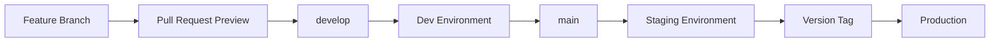
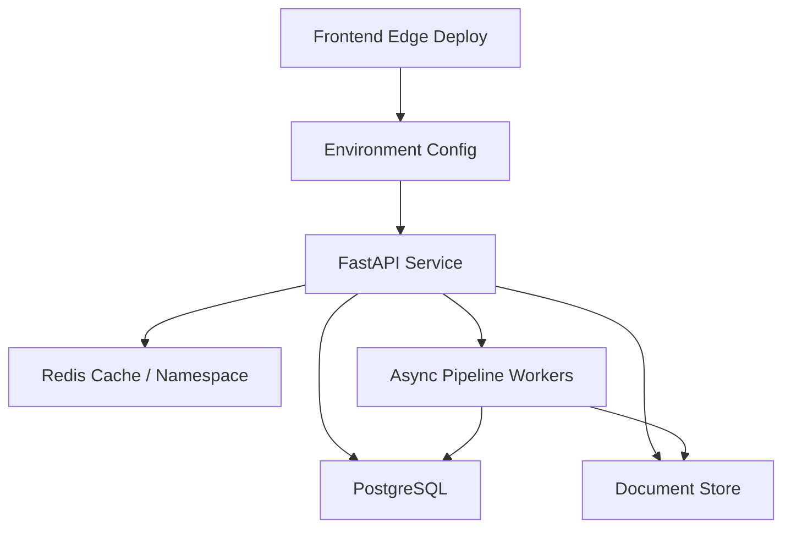
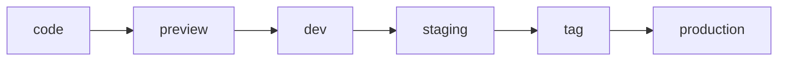

# Dev / Staging / Production：小團隊也需要的環境分層策略

## 前言 (Introduction)

很多小團隊或個人開發者一開始會覺得環境分層太重：本機能跑、main branch 能部署，似乎就足夠了。直到第一次發生這些事情：

1. 一個 migration 在本機成功，但 production schema 不一樣。
2. 前端 build 正常，部署後才發現 API base URL 指到錯誤環境。
3. OAuth、快取、CORS、secret rotation 在本機都測不到。
4. 修 bug 的 hotfix 和下一版功能混在同一條 deploy path 裡。

Dev / Staging / Production 的價值，不是讓流程看起來更企業化，而是把「不確定性」隔離在正確的位置。Dev 用來快速整合，staging 用來模擬 production，production 只接受已驗證的 release。

對一個 React 19 + TypeScript + Vite 前端、FastAPI 後端、Docker + Caddy + Redis 基礎設施、PostgreSQL / Firestore-style hybrid data layer 的系統來說，環境分層是產品速度的一部分。

## 架構設計 (Architectural Overview)

一個簡潔但實用的環境策略可以長這樣：

這條線的重點不是「環境比較多」，而是每一站回答不同問題：

| 階段 | 主要問題 | 應該驗證的事 |
|---|---|---|
| Preview | 這個 PR 自己能不能建置？ | typecheck、lint、build、UI review |
| Dev | 最新整合結果有沒有破？ | API contract、migration、基本 smoke test |
| Staging | 下一個 release 是否接近 production？ | secrets、cache、OAuth、reverse proxy、資料層 |
| Production | 已驗證版本是否健康？ | health check、error rate、rollback target |

完整系統可以想成多條部署軌道對齊：

環境切分的目的，不是複製三套完全一樣的昂貴基礎設施，而是確保 release 在進 production 前，已經通過足夠接近真實世界的檢查。

## 方法論拆解 (Methodology Breakdown)

### 1. 把 branch strategy 和 environment strategy 綁在一起

如果 branch 和 environment 沒有對應關係，部署就容易變成口頭約定。比較穩定的方式，是讓 promotion path 很清楚：

這樣每個人都知道：功能先進 preview，整合進 dev，release candidate 進 staging，最後才用 tag 或 release identity 進 production。

### 2. 每個環境都要有自己的 secret 邊界

環境分層最怕「看起來分開，實際上共用」。最危險的共用通常不是程式碼，而是 secret、資料庫與 cache。

最低限度，每個環境應該分開：

- API base URL
- OAuth callback / allowed origins
- JWT 或 session signing secret
- Redis namespace 或 instance
- Database connection
- Object storage / document store namespace
- Third-party API quota 或測試 credentials

這不是為了潔癖，而是為了避免 dev 的錯誤資料、測試登入、或 cache key 污染 production。

### 3. Staging 的任務是像 production，不是像 dev

Dev 可以吵、可以快、可以常常壞。Staging 不一樣。Staging 的任務是回答：「如果我現在把這個 release 推上去，它在 production-like 條件下會不會壞？」

因此 staging 應該盡量接近 production：

- 同樣的 reverse proxy 模式。
- 同樣的 Docker image build path。
- 同樣的 secret loading 方式。
- 類似的 cache headers。
- 類似的 OAuth / CORS 設定。
- 類似的 database migration 流程。

流量規模可以不同，但拓撲和風險類型應該相似。

### 4. Health check 要回答「能不能服務」，不是只回答「process 還活著」

很多 `/health` 端點只回傳 `ok`，這對部署驗證幫助有限。比較實用的 health check 至少要回答：

1. API process 是否能回應？
2. Redis 是否可連？
3. Database 是否可查？
4. 目前 release identity 是什麼？
5. 這個環境的 runtime stage 是什麼？

注意，health check 不應該洩漏 secret、完整 connection string 或內部拓撲細節。它的目標是讓 CI/CD 和值班的人能快速判斷「這個版本是否能服務」。

### 5. Cache 與 CDN 也是 release 的一部分

如果前端部署在 edge network，後端又有 Redis cache，那 release 流程不能只看 image 有沒有更新。它還要回答：

- 新版 API response schema 是否會被舊快取污染？
- edge cache TTL 是否會讓使用者看到不一致的前後端版本？
- 什麼情況應該等短 TTL 自然過期，什麼情況需要 host-scoped purge？
- Redis key 是否包含 schema version 或 environment namespace？

這些細節平常很無聊，但一旦前後端 contract 改了，它們會突然變成最重要的問題。

## 生產環境踩坑與優化 (Production Optimization)

第一個踩坑是 **環境變數命名一致，但值的意義不一致**。例如 dev 和 staging 都叫 `DATABASE_URL`，但 staging schema 比 production 舊。解法不是改變命名，而是建立環境 bootstrap checklist：migration version、seed data、CORS origins、OAuth callback、Redis namespace、worker concurrency 都要被檢查。

第二個踩坑是 **staging 不是 production 的縮小版，而是另一個 dev**。如果 staging 使用不同 reverse proxy、不同 cache header、不同登入設定，那它就無法回答「production 會不會壞」。Staging 不必有同等流量，但部署拓撲、API gateway、cache policy 和 secret loading 方式應盡量一致。

第三個踩坑是 **production deploy 沒有 release identity**。使用 version tag 或 release ID 的目的，是讓每次部署都有可追蹤的邊界。當錯誤率上升時，你應該能快速回答：

1. 現在 production 跑的是哪個版本？
2. 這個版本對應哪個 commit？
3. 它和上一個健康版本差在哪裡？
4. 如果要回滾，回到哪一個 tag？

第四個踩坑是 **非 production 的登入與 QA 流程被忽略**。如果系統使用 OAuth 或企業登入，E2E 測試通常無法穩定走完整登入流程。比較務實的做法，是提供一個只在 non-production 啟用的測試登入入口，並用 secret、環境檢查和明確的 production guardrail 保護它。這讓瀏覽器自動化可以測真正的產品頁面，而不是永遠卡在登入牆。

第五個踩坑是 **把部署成功等同於 release 成功**。部署只是把程式放上去；release 還包含 health check、錯誤率觀察、前端載入、API smoke test、cache 狀態，以及必要時的 rollback plan。對小團隊來說，這些檢查不需要很重，但要固定。

## 圖表與配圖建議 (Visual Plan)

### 圖 1：Branch-to-Environment Promotion Path

- **Purpose**：讓讀者快速理解 code 如何一步步進 production。
- **Placement**：放在架構設計第一段。
- **Caption**：`好的環境分層不是多幾個網址，而是讓每次 promotion 都有證據。`
- **Prompt**：`A clean editorial diagram showing code moving from feature branch to preview, dev, staging, version tag, and production. Use a transit-map style, neutral colors, no logos, no brand names.`

### 圖 2：三個環境回答三種問題

- **Purpose**：把 dev、staging、production 的不同責任視覺化。
- **Placement**：放在方法論開頭或文章摘要旁。
- **Caption**：`Dev 找整合問題，staging 找 release 問題，production 只承接已驗證版本。`
- **Prompt**：`Three-column technical infographic comparing dev, staging, and production environments, with rows for purpose, data, secrets, cache, and deployment trigger. Minimal, readable, white background.`

### 圖 3：Release Readiness Checklist

- **Purpose**：讓文章更像真實工程經驗，而不是抽象架構談話。
- **Placement**：放在生產環境踩坑段落前。
- **Caption**：`部署前要問的不是「能不能上」，而是「哪些證據顯示它可以上」。`
- **Prompt**：`A deployment readiness checklist illustration with checks for build, tests, migration, health check, cache policy, secrets, rollback target, and monitoring. Clean product engineering style.`

### 圖 4：Cache / CDN Freshness Window

- **Purpose**：說明為什麼 release 不只和 container 有關，也和 cache 有關。
- **Placement**：放在 cache 與 CDN 段落。
- **Caption**：`前端在 edge、後端有 Redis 時，cache policy 也是 release design。`
- **Prompt**：`A layered timeline chart showing browser cache, edge cache, Redis cache, and database freshness windows during a release. Technical blog style, neutral colors.`

## 延伸閱讀與參考資料 (References)

- [GitHub Actions deployments and environments](https://docs.github.com/en/actions/reference/workflows-and-actions/deployments-and-environments)：理解 environment secrets、deployment protection rules 與環境變數。
- [Cloudflare Pages 官方文件](https://developers.cloudflare.com/pages/)：理解 edge frontend deployment、Git integration 與 static asset deployment。
- [Docker Compose 官方文件](https://docs.docker.com/compose/)：理解用 Compose 管理 multi-container application lifecycle。
- [Caddy reverse proxy quick-start](https://caddyserver.com/docs/quick-starts/reverse-proxy)：理解 reverse proxy 與 HTTPS 前置層的基本模式。
- [Redis caching patterns](https://redis.io/solutions/caching/)：理解 cache-aside 對 read-heavy workload 的適用情境。

## 總結 (Conclusion)

Dev / Staging / Production 分層不是大型公司的儀式，而是一個降低發布風險的設計模式。它把問題分流：

1. Dev 找整合問題。
2. Staging 找 release 問題。
3. Production 只承接已驗證版本。

對小團隊來說，最重要的不是一次做到完美，而是先建立清楚的 promotion path：從 code 到 preview，接著進 dev、staging，最後用明確的 tag 或 release identity 進 production。

只要這條路徑穩定，你就能把更多工程決策變成可驗證的 checkpoint：typed config、health check、cache policy、migration version、release identity、rollback target。這些東西看起來都不華麗，但它們是讓產品可以持續演進的底座。
